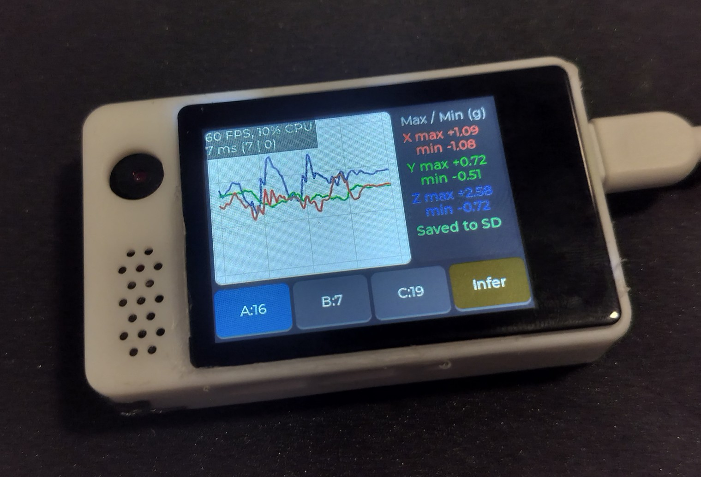
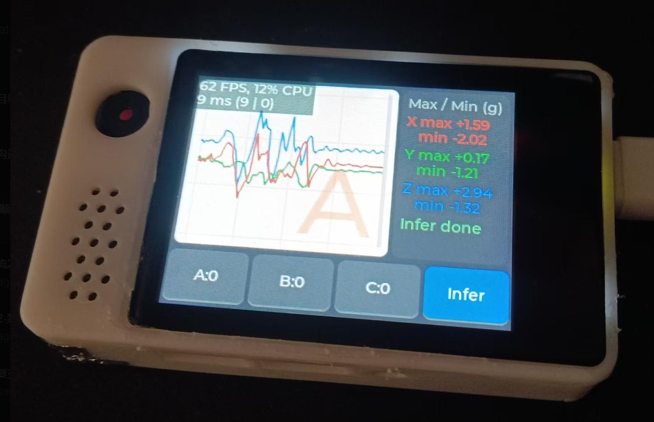
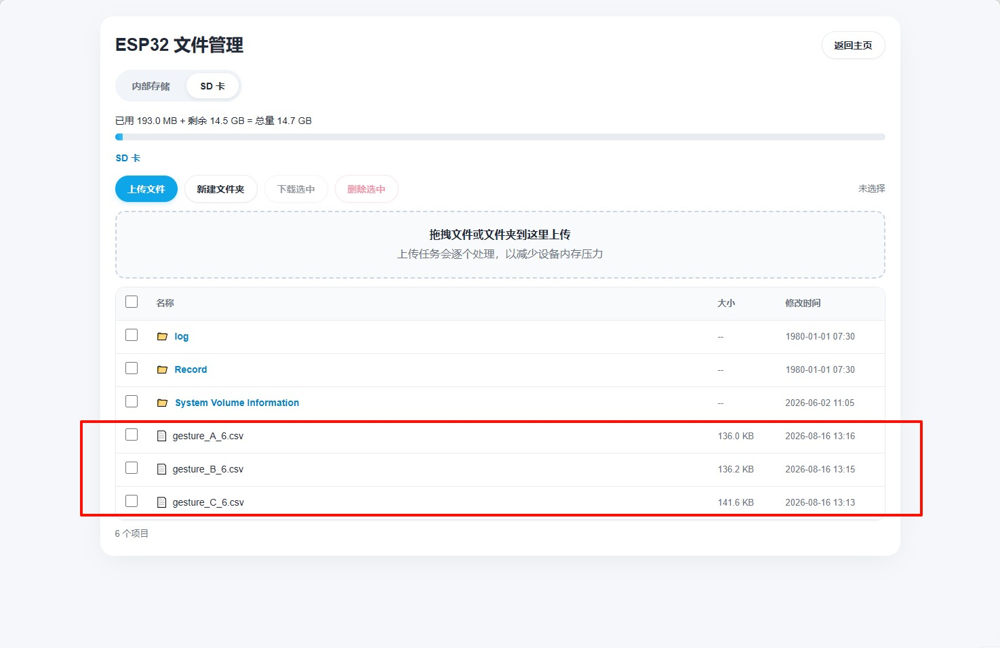
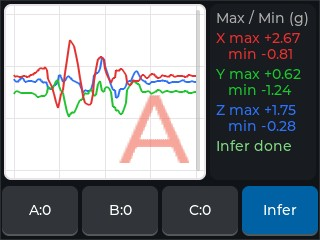
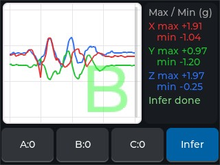
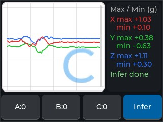

# ESP32-S3 IMU 手势识别 边缘AI Demo（嘉立创实战派）

基于 **嘉立创实战派 ESP32-S3（LCKFB-SZPI-ESP32S3）** + 板载 **QMI8658 IMU** 的手势识别示例：
按一次 BOOT 按键采集 2 秒三轴加速度，屏幕实时显示波形，并可一键完成 A/B/C 三轴手势的实时推理。

> 官方硬件文档：[立创实战派 ESP32-S3 Wiki](https://wiki.lckfb.com/zh-hans/szpi-esp32s3/) 
>
> 项目起始模板：[createskyblue/esp32s3_idf_template](https://github.com/createskyblue/esp32s3_idf_template)
> 
> 邮箱：createskyblue@outlook.com
>
> 博客：https://createskyblue.github.io/

## 边缘AI经典应用场景
- 异常震动检测
- 有害气体预警
- 电弧故障检测
- 电机故障检测
- 人体运动分类

## 效果演示

| 数据采集 | 实时推理 |
|---|---|
|  |  |

## 背景

使用嘉立创实战派 ESP32-S3 实现基于 IMU 的手势识别 Demo，覆盖从数据采集到模型部署的完整链路。
该板集成 ST7789 屏幕、FT5x06 触摸、QMI8658 六轴 IMU 与 SD 卡槽，无需外接模块即可完成
「采集 → 标注 → 训练 → 部署 → 实时推理」的闭环演示。

## 开发流程

1. **手势数据采集**：QMI8658 加速度计 ±4 g / 50 Hz 采样，单次 2 秒（100 样本 × 3 轴），
   按 A/B/C 分类追加写入 SD 卡 CSV（三轴交错存储，参考 Nano Edge AI 格式）。
   
2. **数据清洗**：去趋势（逐轴减去窗口均值）、剔除异常/丢失样本，统一量纲到 g。
3. **数据增强**：Hann 加窗 + 64 点 STFT 滑窗（偏移 0/36），扩展频谱特征并抑制频谱泄漏。
4. **特征筛选**：每轴取 FFT 幅度谱 bin 1..32（去 DC），每窗 64 维、三轴共 **192 维**特征。
5. **模型基准测试**：在线性 SVM、浅层网络等候选结构上对比精度/体积/算力，选定
   「线性 one-vs-rest SVM + 温度缩放 Softmax」（3×192 系数 ≈ 3 KB，训练集 100% 正确）。
6. **部署**：模型常量（窗函数、FFT 系数、SVM 权重）固化为 `gesture_classifier_model.h`，
   以纯 C 组件移植到 ESP32-S3，无动态分配，直接调用。

## 推理结构

分类器组件位于 `components/gesture_classifier/`（由 `gesture_c` 推理库移植，纯 C99 + libm）：

```
输入 float in[300]（100 样本 × 3 轴，X/Y/Z 交错，单位 g）
  │
  ├─ 1. 去趋势 Detrend      每轴减去窗口均值，消除静态偏置
  ├─ 2. STFT               每轴 2 个 Hann 窗（64 点，偏移 0/36）→ 64 点实数 FFT
  │                        → 取幅度谱 bin 1..32，×1/16 归一化 → 每轴 64 维
  ├─ 3. 特征交错 Interleave 192 维特征按 特征优先/轴交错 排列：feat[f*3+c]
  ├─ 4. 线性 SVM           3 组 one-vs-rest 权重（3×192 + 3 截距）→ 3 个分数
  └─ 5. Softmax + Argmax   温度 β=5.0 缩放后 softmax → 概率 + 类别
                           类 id：0=C, 1=B, 2=A
```

- **实时性**：50 Hz 采集 2 秒 → 分类计算毫秒级完成；结果以**彩色半透明大字**叠加到图表右下角（A=红 / B=绿 / C=蓝）。
- **资源占用**：零动态分配，峰值栈约 4–5 KB，模型常量存 Flash 约 3 KB。
- **交互**：`Infer` 按钮切换推理模式，物理 `BOOT` 按键触发采样；`A/B/C` 按钮切换 CSV 标注模式。

| 推理 A（红） | 推理 B（绿） | 推理 C（蓝） |
|---|---|---|
|  |  |  |

## 功能

| 功能 | 说明 |
|------|------|
| 三轴波形 | 2 s @ 50 Hz 加速度实时波形 + 每轴最大/最小值 |
| CSV 标注 | A/B/C 分类写入 SD 卡，每次开机新建文件，追加写入 |
| 实时推理 | Infer 模式 + BOOT 触发，三分类彩色结果叠加图表 |
| 截图 | 点击图表区保存全屏截图到 SD 卡（`/sdcard/screenshots/`） |
| 全屏 60 fps | LVGL 整帧 PSRAM 缓冲 + RGB565_SWAPPED + 异步 DMA（详见模板仓库刷新率章节） |

## 使用方法

1. **数据采集**：先点底部 `A` / `B` / `C` 按钮选中手势类别（按钮右侧数字为该类已保存行数），再按一下 **BOOT** 键触发 2 秒采样；波形实时显示，结束后自动追加写入 SD 卡对应 CSV。
2. **实时推理**：点 `Infer` 按钮进入推理模式，再按 **BOOT** 键完成 2 秒采样；识别结果以彩色半透明大字叠加在图表右下角（A=红 / B=绿 / C=蓝），推理结果不写入 SD 卡。
3. **截图**：点击图表区域，全屏截图自动保存到 SD 卡 `/sdcard/screenshots/`。
4. **查看数据**：连接设备开出的 WiFi 热点，浏览器打开 Web 面板，在文件管理器里在线浏览 / 下载 SD 卡中的 CSV 与截图。

## 硬件接线（立创实战派）

| 外设 | 引脚 |
|------|------|
| IMU QMI8658（I2C，与 LCD 触摸共用） | SDA=IO1, SCL=IO2 |
| SD 卡（SDMMC 1-bit） | CLK=IO47, CMD=IO48, D0=IO21 |
| LCD ST7789 | SPI MOSI=IO40, SCLK=IO41, DC=IO39, 背光=IO42, CS=PCA9557(0x19, IO0) |

## 快速开始

```bash
idf.py set-target esp32s3
idf.py build
idf.py -p /dev/ttyACM0 flash monitor
```

WiFi 凭据写入 `data/wifi_config.json`（已被 git 忽略，勿提交密码）。