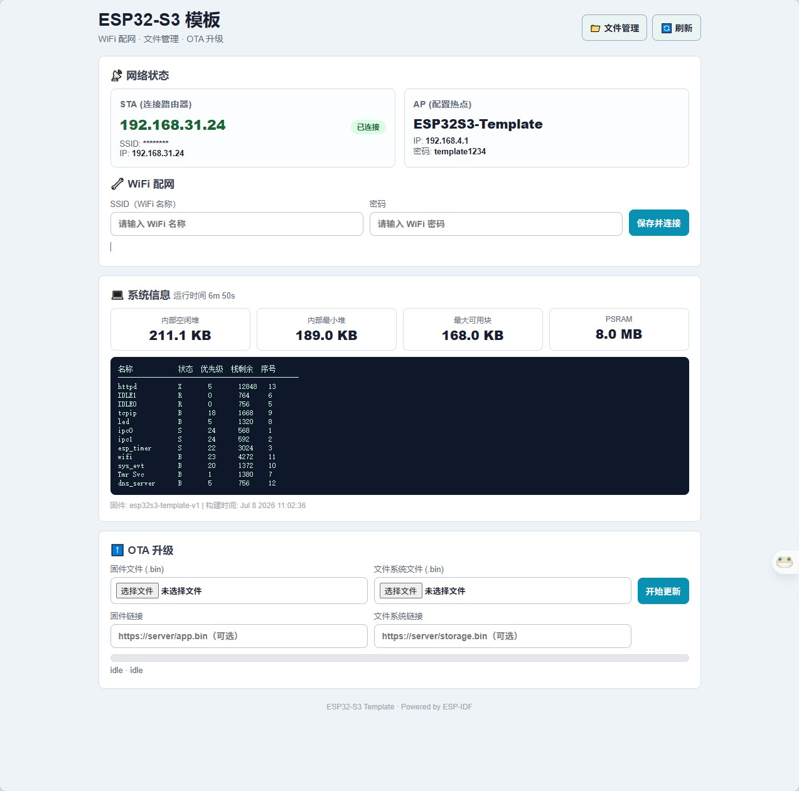
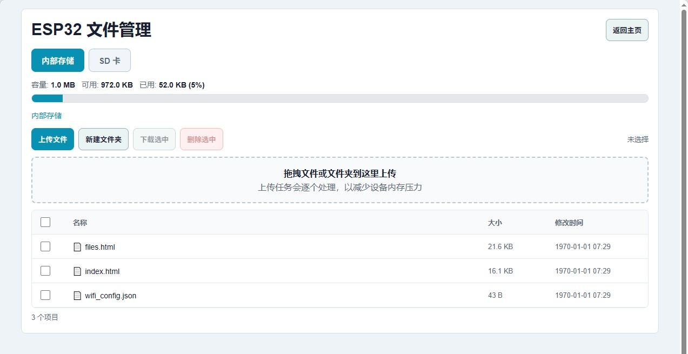

# ESP32-S3 通用模板

基于 ESP32-S3 的基础设施模板，提供 WiFi 配网、文件系统、SD 卡、OTA 升级等开箱即用的功能。适合作为新项目的起点。

## 功能一览

| 功能 | 说明 |
|------|------|
| **WiFi AP+STA** | 同时运行 AP 热点（`ESP32S3-Template`）和 STA 客户端 |
| **Web 配网** | 网页端输入 SSID/密码，配置持久化到 LittleFS，自动重连 |
| **Captive Portal** | DNS 劫持，手机连上 AP 后自动弹出配网页面 |
| **LittleFS** | 1 MB 内部闪存文件系统，存放网页和配置文件 |
| **SD 卡** | SPI 模式，FAT 文件系统，支持热插拔（可选，失败不阻塞启动） |
| **文件管理器** | Web 界面浏览/上传/下载/删除/新建文件夹，支持内部 Flash 和 SD 卡双存储 |
| **OTA 升级** | 支持固件 + 文件系统远程升级，也支持网页直接上传刷写 |
| **SD 日志** | 所有 ESP_LOG 输出自动双写（串口 + SD 卡 `/sdcard/log/`），定时滚动 |
| **SNTP 授时** | STA 连接成功后自动同步北京时间（ntp.aliyun.com） |
| **LED 指示** | 绿灯心跳（500ms 翻转），蓝灯 WiFi/数据活动指示 |
| **调试接口** | `/debug.json` 查看堆内存、PSRAM、任务列表、运行时间 |

## 界面预览





## 硬件接线

### LED（低电平点亮）

| LED | GPIO |
|-----|------|
| 红  | IO15 |
| 黄  | IO7  |
| 绿  | IO6  |
| 蓝  | IO5  |

### SD 卡（SPI 模式）

| 信号 | GPIO |
|------|------|
| MOSI | IO11 |
| SCLK | IO12 |
| MISO | IO13 |
| CS   | IO10 |
| CD   | IO14 |

## 网页端点

| 路径 | 说明 |
|------|------|
| `/` | 仪表盘首页（WiFi 状态、配网表单、系统信息） |
| `/files` | 文件管理器 |
| `/files.html` | 文件管理器（独立页面） |
| `/network.json` | 网络状态 JSON |
| `/wifi_config.json` | WiFi 配置读写（GET/POST） |
| `/debug.json` | 系统调试信息 |
| `/ota/status` | OTA 升级状态 |
| `/ota/start` | 触发远程 OTA（POST JSON） |
| `/ota/upload/firmware` | 上传固件刷写 |
| `/ota/upload/filesystem` | 上传文件系统镜像 |
| `/api/fs` | 文件管理 API（list/download/delete/mkdir/upload） |
| `/hello` | Hello World 示例端点（自定义业务模板） |

## 快速开始

```bash
# 1. 克隆或复制此模板
cp -r esp32s3_template my_project && cd my_project

# 2. （可选）预设 WiFi 凭据
cp main/wifi_config.example.h main/wifi_config.h
# 编辑 main/wifi_config.h 填入 SSID 和密码

# 3. 编译烧录
idf.py set-target esp32s3
idf.py build
idf.py -p COMx flash monitor
```

## 首次使用

设备启动后：

- **无 WiFi 配置**：手机会搜到热点 `ESP32S3-Template`（密码 `template1234`），连接后浏览器打开任意网址自动跳转配网页面
- **已配置 WiFi**：设备自动连接路由器，查看路由器后台获取 IP，浏览器访问即可

## 项目结构

```
├── CMakeLists.txt
├── partitions.csv              # OTA 分区表 (app×2 + LittleFS)
├── sdkconfig.defaults          # ESP-IDF 默认配置
├── main/                       # 应用层（入口 + 自定义业务端点）
│   ├── main.c                  # 入口：LED → SD卡 → web_platform → hello_web
│   ├── hello_web.c/.h          # ★ 自定义 HTTP 端点模板（从这里开始写业务）
│   └── wifi_config.example.h
├── data/
│   ├── index.html              # 仪表盘首页
│   └── files.html              # 文件管理器页面
└── components/
    ├── web_platform/           # Web 基础设施（HTTP 服务器 + 页面路由）
    ├── wifi_manager/           # WiFi APSTA + DNS 劫持 + SNTP + 凭据持久化
    ├── ota_manager/            # OTA 状态机 + 下载刷写 + 上传逻辑
    ├── file_manager/           # Web 文件管理器 API
    ├── led_task/               # 四路 LED 驱动
    ├── sd_card/                # SD 卡 SPI 驱动
    ├── sd_logger/              # 日志双写到 SD 卡
    └── json/                   # cJSON 辅助组件
```

## 添加自己的业务

项目采用 **平台 + 业务** 分层架构：

1. `components/web_platform/` — 基础设施，WiFi / OTA / 配网 / 仪表盘，开箱即用
2. `main/hello_web.c/.h` — 业务端点模板，从这里开始写你的 HTTP handler

**三步添加自定义端点：**

```c
// 1. 在 hello_web.c 中仿照 hello_handler() 写你的 handler
// 2. 在 hello_web_register() 中注册新的 URI
// 3. main.c 中的注册流程已就绪：
//    web_platform_init()
//    hello_web_register(web_platform_get_server())   // ← 你的业务
//    web_platform_register_static_fallback()          // 必须最后
```

**更复杂的场景**：直接在 `components/` 下新建独立组件，在 `main/CMakeLists.txt` 中添加依赖即可。

**基础设施模块**（`web_platform` / `file_manager` / `led_task` / `sd_card` / `sd_logger`）已全部独立为 `components/` 下的可复用组件，新项目可直接引用。

模板已为你处理好了 WiFi、存储、Web 服务等基础设施，你只需关注自己的业务逻辑。
